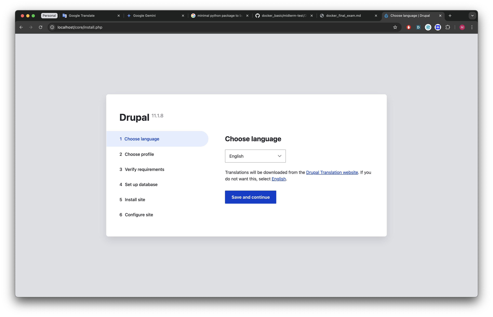
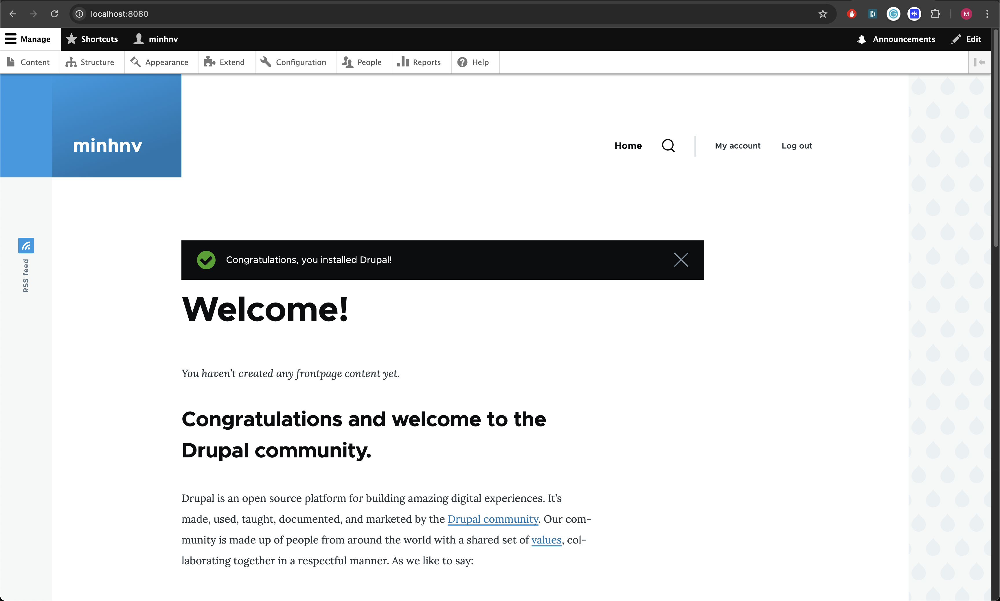
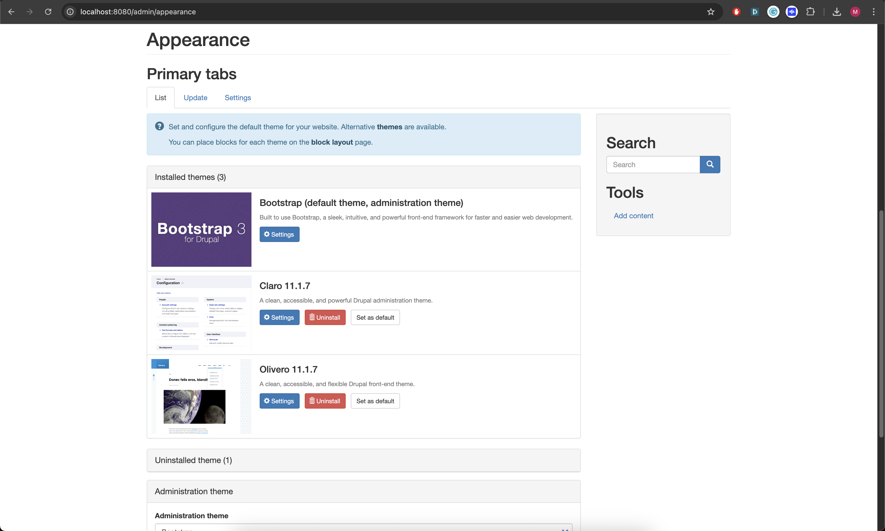
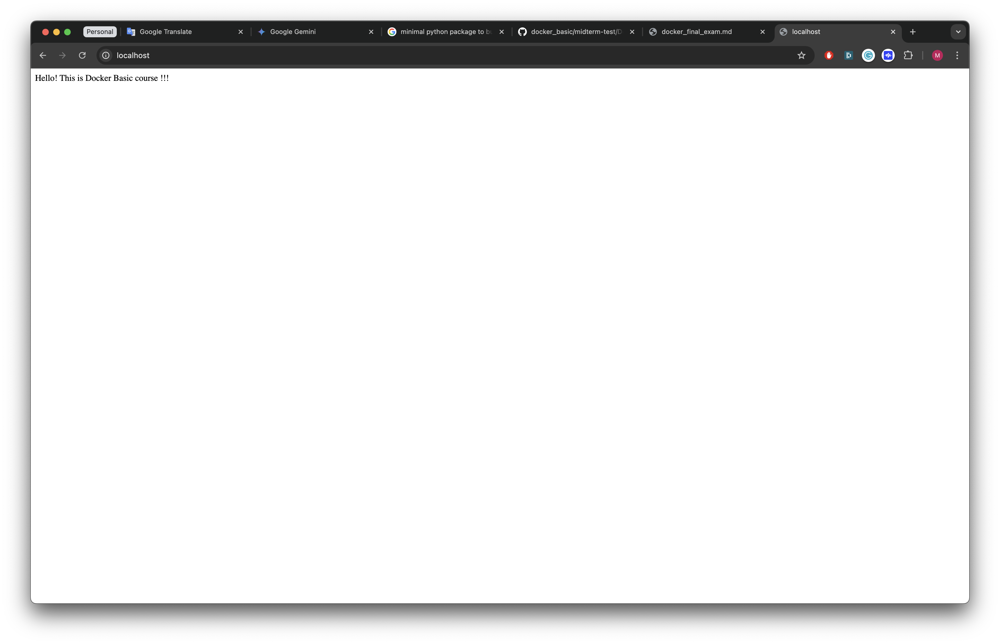

# Question 1: Docker file for Drupal without DB.



# Question 2: Docker combose file - Drupal with PostGres DB and bootstrap themes.

## Finished setup Drupal and PostGres DB:



## Finished setup bootstrap themes:



# Question 3: Docker file multiple stage for python.

## Images comparasion:

```bash
REPOSITORY        TAG       IMAGE ID       CREATED          SIZE
drupal            latest    119dcf3af7f0   24 minutes ago   668MB
ubuntu-python-1   latest    dd2f23b6567b   10 hours ago     194MB
ubuntu-python     latest    98f1d9676f0d   11 hours ago     487MB
```

>* *ubuntu-python* image is built without multiple stagging which has `487MB`.
>* *ubuntu-python-1* image is built with multiple stagging which has `194MB`.

## Website running:

```bash
->  exam git:(main) -> curl http://localhost
Hello! This is Docker Basic course !!!%
```


